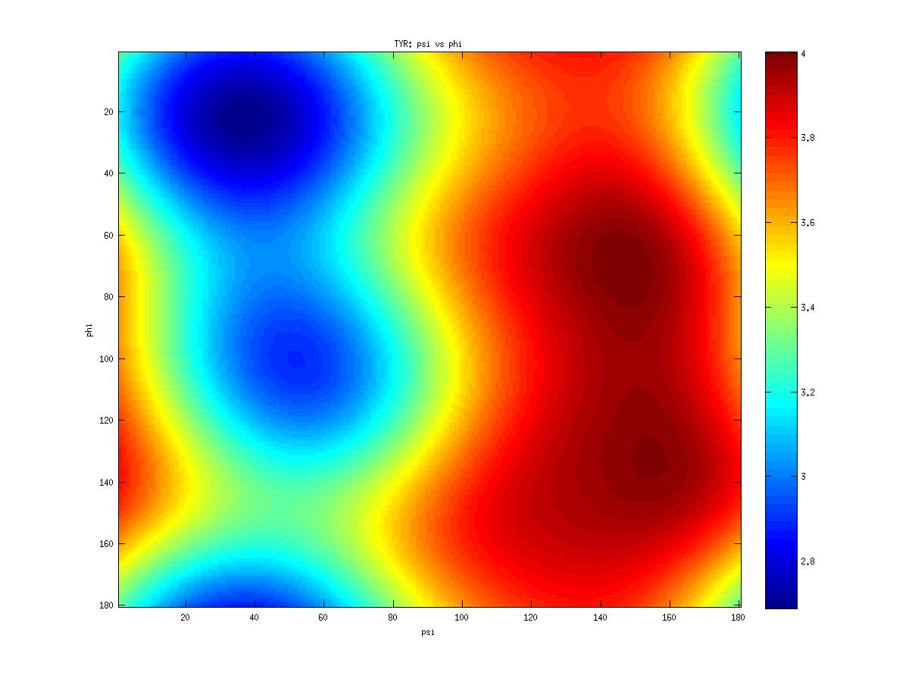
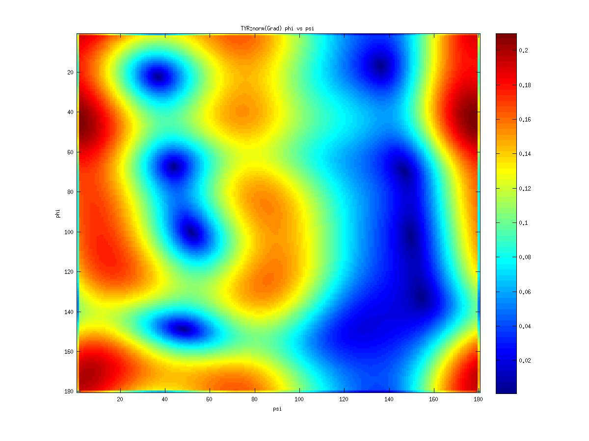
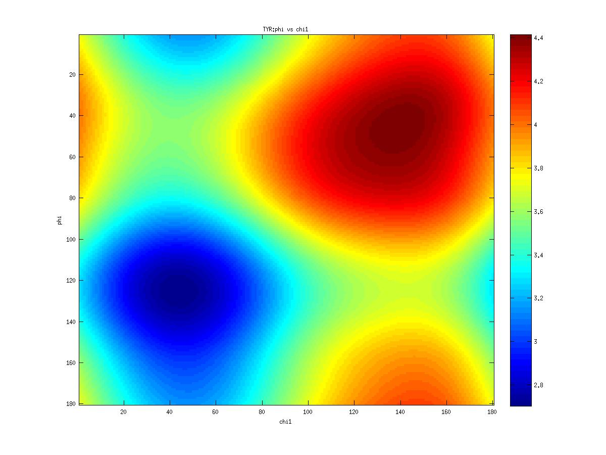
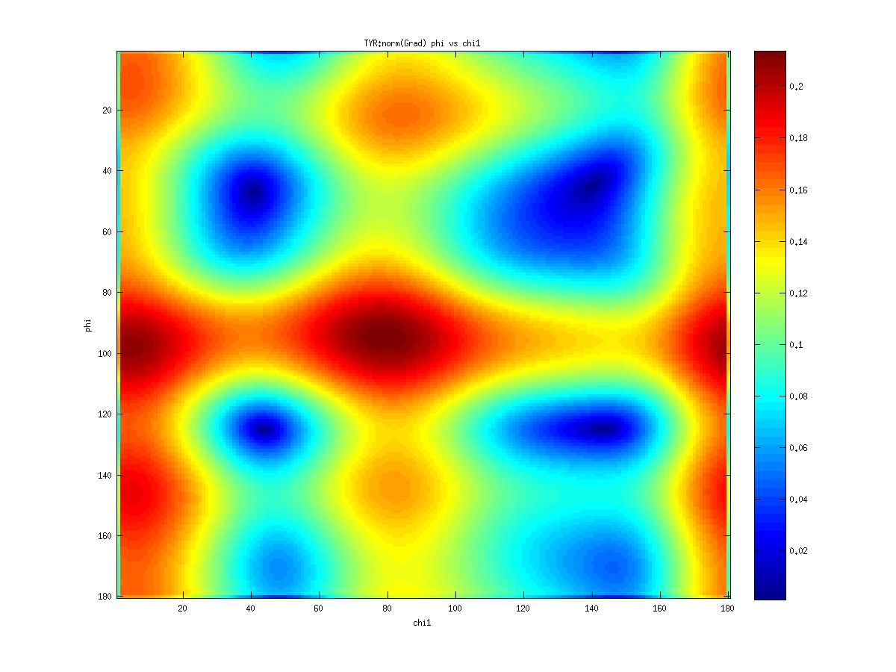
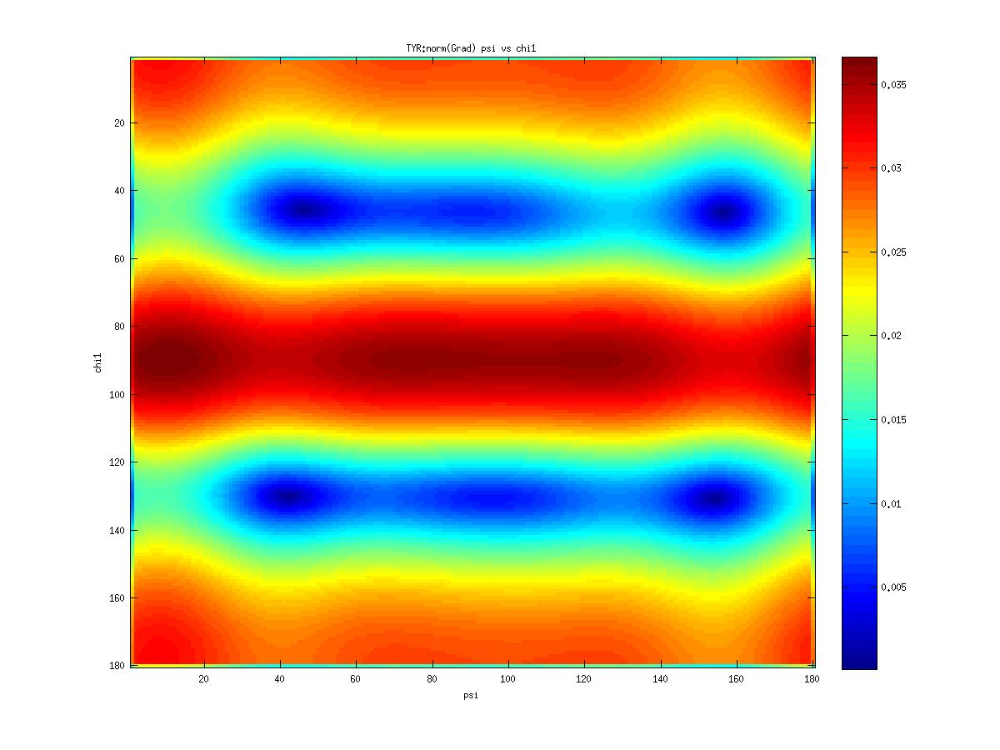
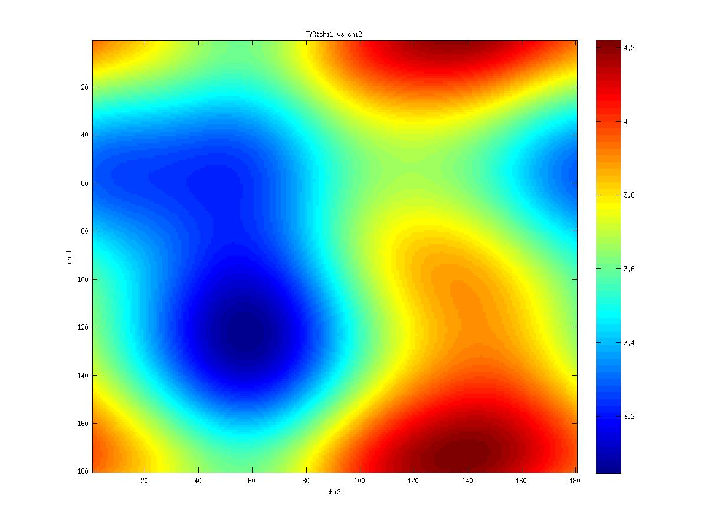

# Protein periodicity 

http://melroleandro.github.io/Protein-periodicity/

This is the base for a project on packing charged multibody systems with implicit
solvation. This scripts are used for the extraction of statistical dada from large samples of 
crystal structures, selected from the PDB. The generated statistics are used on  two type of libraries
for multibody dynamics: a library with statistical potentials for pairs of dihedral angles 
in the main chain local conformation,  and a rotamer libraries. This  libraries are defined as a 
set of discrete probability distribution, and used to generat
internal forces multibody systems.

- Examples of statistical potentials generated from two dihedral angles on a protein main chain:

- Examples of statistical potentials generated between dihedral angles and rotamers in an amino acid:

For more information: http://melroleandro.github.io/Protein-periodicity/

## Extraction of Statistic for each amino acid

### For Amino TYR

 SAMPLE SIZE: 1615
 
 
 
|     | B-factor |
| --- | --- |
| Mean | 18.34 |
| Median | 15.38 |
| Variance | 144.59 |
| Standard deviation | 12.02 |
| Skewness | 2.73 |
| Kurtosis | 15.87 |
 

|     | C-CA | N-CA | peptid plane |
| --- | --- | --- | --- |
| Mean | 2.08 | 1.79 | 1.60 |
| Median | 1.53 | 1.46 | 1.33 |
| Variance | 1.50 | 0.77 | 0.54 |
| Standard deviation | 1.23 | 0.88 | 0.73 |
| Skewness | 2.00 | 2.85 | 3.07 |
| Kurtosis | 5.47 | 10.28 | 12.80 |
| corrcoef | 1.00 | 0.67 | 0.22 |
| corrcoef | 0.67 | 1.00 | 0.15 |
| corrcoef | 0.22 | 0.15 | 1.00 |

|     | PHI | PSI |
| --- | --- | --- |
| Mean | -89.45 | 111.99 |
| Median | -88.90 | 122.94 |
| R Length | 0.48 | 0.14 |
| Variance | 0.52 | 0.86 |
| Standard deviation | 1.02 | 1.31 |
| Standard deviation 0 | 1.21 | 1.97 |
| Skewness | -0.10 | 0.48 |
| Kurtosis | 0.34 | 0.18 |

### Inferential Statistics for $$\phi$$-$$\psi$$ 

Tests for Uniformity

- Rayleigh Test, P = 0.00 0.00
- Omnibus Test,  P = 0.00 0.00
- Rao Spacing Test,  P = 0.50 0.50
- V Test (r = 0),  P = 0.40 1.00

### Measures of Association $$\phi$$-$$\psi$$

Circular-Circular Association
- Circ-circ corr phi-psi coeff/pval:	-0.22	 0.000
- Circ-line corr phi-C-CA coeff/pval:	0.65	 0.000
- Circ-line corr phi-N-CA coeff/pval:	0.43	 0.000
- Circ-line corr psi-C-CA coeff/pval:	0.32	 0.000
- Circ-line corr psi-N-CA coeff/pval:	0.21	 0.000
### Statistics $$\chi_1$$

|     | CHI_1 |
| --- | --- |
| Mean resultant vector | 108.13 |
| Median | 108.13 | 
| R Length | 0.05 | 
| Variance | 0.95 | 
| Standard deviation | 1.38 |
| Standard deviation 0| 2.41 |
| Skewness | -0.00 |
| Kurtosis | 0.00 |

### Inferential Statistics $$\chi_1$$

#### Tests for Uniformity
- Rayleigh Test, 	 P = 0.01
- Omnibus Test, 	 P = 0.05
- Rao Spacing Test, 	 P = 0.50
- Circ-circ corr phi-chi1 coeff/pval:	0.00	 0.850
- Circ-circ corr psi-chi1 coeff/pval:	0.04	 0.141

 

### Statistics $$\chi_2$$

|     | CHI_2 |
| --- | --- |
| Mean resultant vector | -86.02 |
| Median | -86.02 |
| R Length | 0.38 |
| Variance | 0.62 |
| Standard deviation | 1.11 |
| Standard deviation 0 | 1.38 |
| Skewness | 0.27 |
| Kurtosis | 0.19 |

### Inferential Statistics $$\chi_2$$ 

#### Tests for Uniformity

- Rayleigh Test, 	 P = 0.00
- Omnibus Test, 	 P = 0.00
- Rao Spacing Test, 	 P = 0.50
- Circ-circ corr phi-chi2 coeff/pval:	-0.16	 0.000
- Circ-circ corr psi-chi2 coeff/pval:	0.06	 0.011
- Circ-circ corr chi1-chi2 coeff/pval:	0.01	 0.776

 

### Statistics $$\chi_3$$

|    | CHI_3 |
| --- | --- |
| Mean resultant vector | 11.78 |
| Median | 11.78 |
| R Length | 0.24 |
| Variance | 0.76 |
| Standard deviation | 1.23 |
| Standard deviation 0 | 1.68 |
| Skewness | 0.25 |
| Kurtosis | -0.63 |

### Inferential Statistics $$\chi_3$$

#### Tests for Uniformity

- Rayleigh Test, 	 P = 0.00
- Omnibus Test, 	 P = 0.00
- Rao Spacing Test, 	 P = 0.50
- Circ-circ corr phi-chi3 coeff/pval:	0.00	 0.983
- Circ-circ corr psi-chi3 coeff/pval:	-0.01	 0.788
- Circ-circ corr chi1-chi3 coeff/pval:	0.00	 0.960
- Circ-circ corr chi2-chi3 coeff/pval:	-0.36	 0.000

### $$\phi$$ & $$\psi$$

### $$\chi_1$$

### $$\chi_2$$

